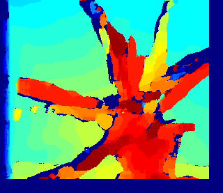

# StereoBM_python
===
An implementation of the classic stereo vision Block Matching(BM) algorithm. Python version
[中国镜像](https://gitee.com/redpower/StereoBM_python)
===
This code implements a classic stereo BM algorithm.
This is not a good implementation. But it is simple enough.

[]
[]

#### System Requirements ####

The reference code is tested on <b>windows 10, Ubuntu 18.04</b> and requires:
- Python 

#### Run ####

```Python
>> python3 stereo_bm.py

```

#### Known issues ####

None

#### License ####
BSD 2-Clause License. See LICENSE.txt for further details.

